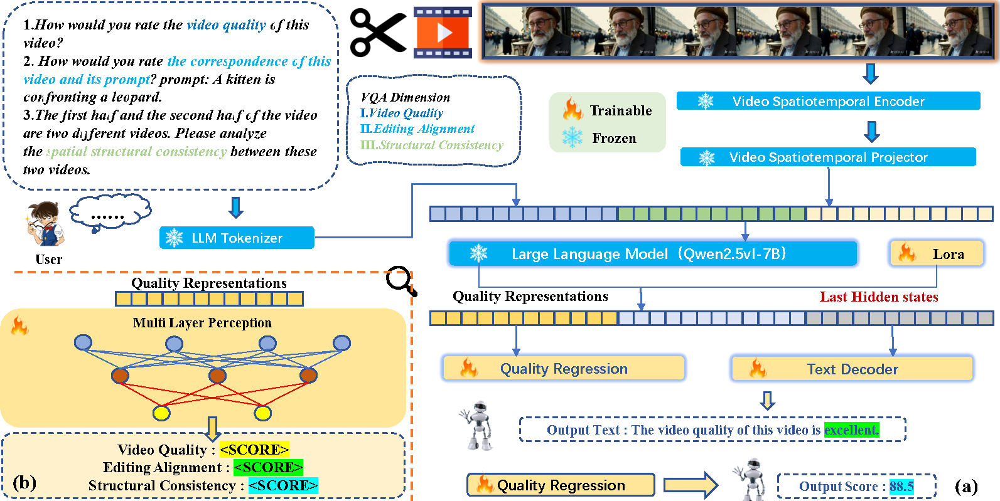
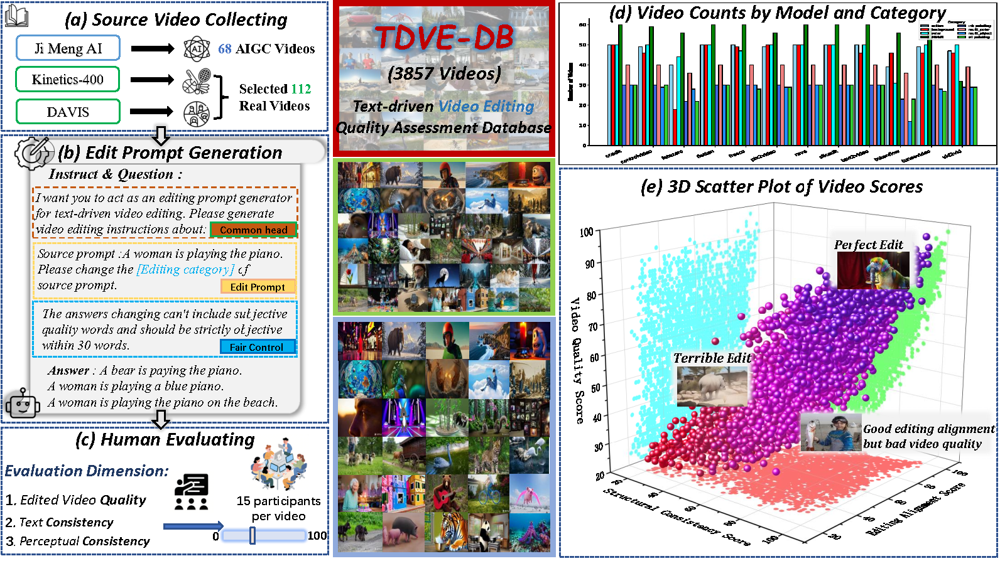

# TDVE-Assessor: Benchmarking and Evaluating the Quality of Text-Driven Video Editing with LMMs

[](https://link_to_your_paper.com) [](https://huggingface.co/datasets/Moyao001/TDVE-DB/tree/main)
[](https://creativecommons.org/licenses/by-sa/4.0/) Official PyTorch implementation for **TDVE-Assessor**, a novel Large Multimodal Model (LMM) based approach for evaluating the quality of text-driven video editing, as presented in our NeurIPS 2025 paper: "[TDVE-Assessor: Benchmarking and Evaluating the Quality of Text-Driven Video Editing with LMMs](https://link_to_your_paper.com)".

TDVE-Assessor integrates spatial and temporal video features into an LMM (Qwen2.5-VL-7B) for rich contextual understanding to provide comprehensive quality assessment across three crucial dimensions:
1.  Edited Video Quality
2.  Editing Alignment (Text-Video Consistency)
3.  Structural Consistency

<p align="center">
  
</p>
<p>
(a) Video features are extracted by a frozen spatiotemporal encoder and aligned to a Large Language Model (Qwen2.5-VL-7B) using trainable projection modules. The LLM, fine-tuned with LoRA, then generates textual feedback for multiple evaluation dimensions via a trainable text decoder, while its last hidden states (quality representations) are input to a quality regression module. The model also supports pairwise comparison fine-tuning. (b) The quality regression module, a trainable MLP, converts these LLM-derived quality representations into numerical scores for dimensions like video quality, editing alignment, and structural consistency.
</p>

We also introduce **TDVE-DB**, the largest and most comprehensive benchmark dataset for text-driven video editing quality assessment, featuring 3,857 edited videos from 12 models across 8 editing categories, annotated with 173,565 human subjective ratings.
<p align="center">
  
</p>
<p>
(a) Acquisition of the source video. (b) Generation of prompt words. (c) Obtaining 170K subjective scores through subjective experiments. (d) The number of videos for different models and different editing categories. (e) Three-dimensional scatter plot of subjective scores.

</p>

## 📝 Table of Contents

- [TDVE-Assessor: Benchmarking and Evaluating the Quality of Text-Driven Video Editing with LMMs](#tdve-assessor-benchmarking-and-evaluating-the-quality-of-text-driven-video-editing-with-lmms)
  - [📝 Table of Contents](#-table-of-contents)
  - [✨ Highlights](#-highlights)
  - [🚀 Getting Started](#-getting-started)
    - [Installation](#installation)
  - [📊 Dataset (TDVE-DB)](#-dataset-tdve-db)
  - [🤖 Model (TDVE-Assessor)](#-model-tdve-assessor)
    - [Model Architecture](#model-architecture)
    - [Pretrained Models](#pretrained-models)
  - [⚙️ Usage](#️-usage)
    - [Data Preparation](#data-preparation)
    - [Train](#train)
    - [Evaluation](#evaluation)
## ✨ Highlights

* **TDVE-Assessor**: A novel LMM-based model (Qwen2.5-VL-7B backbone) achieving SOTA performance for text-driven video editing quality assessment.
* **TDVE-DB**: The largest benchmark dataset for this task, with extensive multi-dimensional human annotations.
* Comprehensive evaluation of 12 state-of-the-art video editing models.
* Code and dataset publicly available to foster future research.

## 🚀 Getting Started

### Installation

1.  **Clone the repository:**
    ```bash
    git clone https://github.com/JuntongWang/TDVE-Assessor.git
    cd TDVE-Assessor
    ```

2.  **Create a virtual environment (recommended):**
    Using Conda:
    ```bash
    conda create -n tdve_assessor python=3.10.16 -y 
    conda activate tdve_assessor
    ```

3.  **Install dependencies:**
    We provide a `requirements.txt` file with the necessary packages.
    ```bash
    pip install -r requirements.txt
    ```

    *(For specific PyTorch installation with CUDA, refer to the [official PyTorch website](https://pytorch.org/get-started/locally/) for commands tailored to your system.)*

## 📊 Dataset (TDVE-DB)

Our TDVE-DB dataset is central to this work.
* **Content**: 3,857 edited videos, 12 editing models, 8 categories, 340 prompts, 173,565 human ratings.
* **Dimensions**: Edited Video Quality, Editing Alignment, Structural Consistency.
* **Access**: The dataset is publicly available on Hugging Face:
    [](https://huggingface.co/datasets/Moyao001/TDVE-DB/tree/main)

Please refer to the Hugging Face page and our paper for detailed information on data structure, collection, and statistics.

## 🤖 Model (TDVE-Assessor)

### Model Architecture

TDVE-Assessor leverages the Qwen2.5-VL-7B Instruct model as its backbone. It processes video frames using the embedded ViT and integrates these visual features with textual prompts (and source video information for structural consistency) within the LMM. A lightweight MLP regression head is then used to predict continuous quality scores for the three dimensions.


For more details, please see Section 4 of our paper.

### Pretrained Models

We plan to release the pretrained weights for TDVE-Assessor. Check back soon for download links and instructions.
* `tdve_assessor_video_quality.pth`
* `tdve_assessor_editing_alignment.pth`
* `tdve_assessor_structural_consistency.pth`


## ⚙️ Usage


### Data Preparation

1.  **Download TDVE-DB**: Follow the instructions [here](#-dataset-tdve-db) to download and prepare the TDVE-DB dataset.
2.  **Organize Data**: "You can find the corresponding training and testing JSON files in the `stage1_dataset` and `stage2_dataset` folders. You will need to modify the root directory paths within these files to match your own terminal's setup."
    ```
    TDVE-DB/
    ├── color/
    │   ├── edit_video/
    │   │   ├── fresco ├──1000.mp4
    │   │   ├── ccedit └──1001.mp4
    │   │   └── ...
    │   └── ...
    │   
    └── ...
    ```
3. If you want to use your own dataset, it's also quite simple. You just need to follow the format of our provided JSON files and add your prompts and video paths accordingly.

### Train

**Stage1:** 
```
bash train_LLM.py
```
Then, merge the model weights well-trained in the first stage with the initial weights (the initial weights can be downloaded from Qwen/Qwen2.5-VL-7B-Instruct on Hugging Face). The merge requires calling:
```
bash merge_lora.sh
```
**Stage2:**
```
bash train_MLP.sh
```
In the training process described above, all you need to do is adjust the paths for the training set, test set, and model input/output within each .sh file. This is very straightforward.

### Evaluation

You can evaluate videos using  pretrained TDVE-Assessor model. The pretrained model will come soon.
Just use 
```
python ./evaluate/eval_auth.py
``` 
What you should do is changing the input. (model and test directory)

